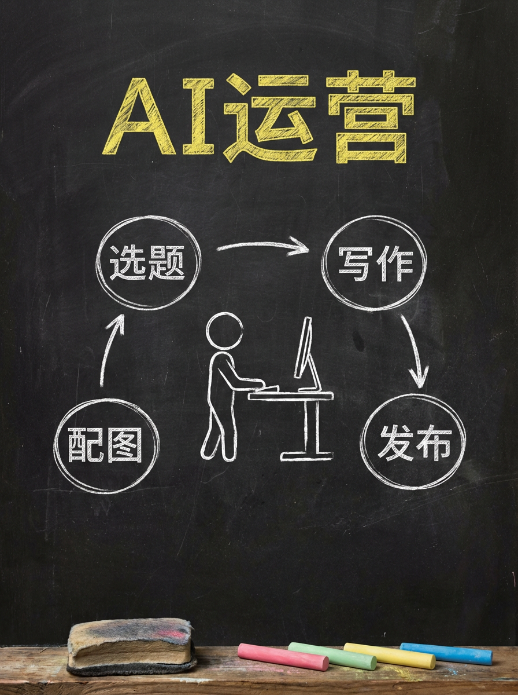
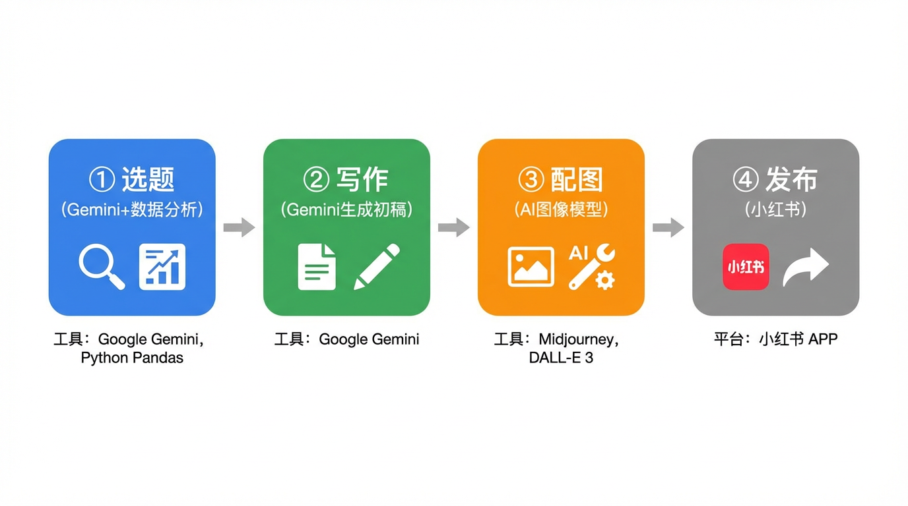
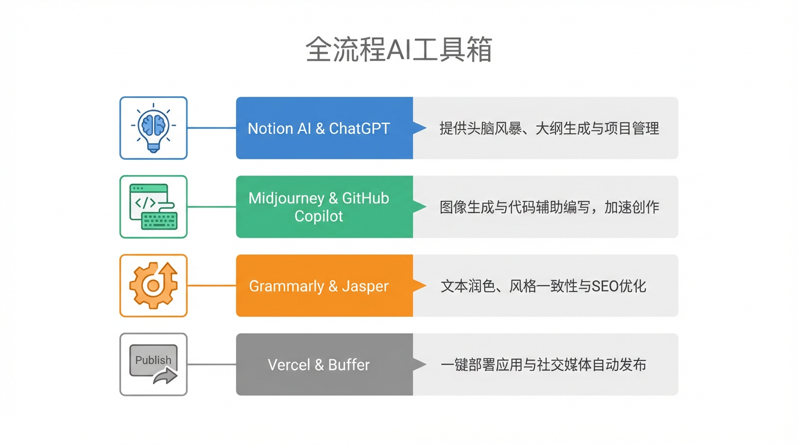
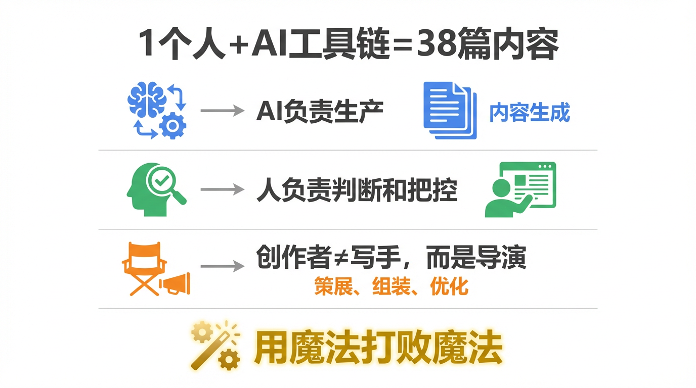

# AI帮我一个人运营这个账号——全流程揭秘

这个账号，从来没雇过一个编辑。

2026年4月，「跟着AI学AI」已经发了**39篇文章**，每篇都有配图，每篇都有选题逻辑，每篇都有话题标签。

我一个人做的。

但"我"后面，跟着一整套AI工具链。

今天我把后台全部打开——告诉你这个账号，**选题、写作、配图、发布**，每一步到底是怎么做的。



---

## 先说那个让人惊讶的数字

39篇文章，平均每篇1200字，4张配图。

如果完全靠人工：
- 选题调研：每篇2小时
- 写作润色：每篇3小时
- 配图设计：每篇找设计师或自己用PS，至少4小时
- 整理标签、排版发布：1小时

一篇文章，10小时打底。39篇，390小时——差不多是**10个工作周**的全职工作量。

实际花了多少时间？

平均每篇**不超过2小时**，其中我盯着屏幕真正在动脑的，可能只有40分钟。

剩下的，AI干了。

---

## 第一步：选题——AI帮我看爆款规律

🔥 **工具：Gemini 2.5 Pro + 自己整理的数据**

选题是整个账号最重要的决策。选错了，文章再好也没人看。

我的做法是：把过去发布的文章数据（阅读量、互动率、保存量）整理成一个表格，然后喂给 Gemini，问它：

> "哪些主题跑得最好？哪些标题形式互动高？当前AI圈有什么我还没聊过的热点？"

Gemini 会分析规律，给我一份**候选选题清单**，通常5到10个，附上每个选题的预估受众和切入角度。

我不是照单全收，而是从里面挑感觉最对的那个。

人的作用是：**最终拍板**。AI的作用是：**把信息量做到我一个人做不到的宽度**。

就像厨师不会自己去田里种菜，但选什么菜上桌，必须是厨师说了算。

---

## 第二步：写作——初稿是AI的，润色是我的

✍️ **工具：Gemini 2.5 Pro（通过 llm.baijia.com API 调用）**

确定选题之后，我会写一段"创作简报"，大概200字：

- 这篇要讲什么核心概念
- 目标读者是谁
- 我希望它是哪种调性（搞笑自黑？还是揭秘感？）
- 有没有必须提的具体例子

把简报扔给 Gemini，让它出一篇1000-1500字的初稿。

初稿通常**骨架是对的，但灵魂差一截**。

AI写出来的文字，准确，但有时候太正确了——像一篇没有体温的科普文。我要做的，是把那些"值得注意的是"改成"说白了就是"，把那些"此外"改成"还有一个更绕的"。

有时候只改10%，有时候要大刀阔斧重写某一段。这个润色的过程，大概30到45分钟。

不是AI全自动，也不是我一个字一个字憋出来的。

是**人机协作**——AI起高楼，我装修。



---

## 第三步：配图——全靠AI画，我只写提示词

🎨 **工具：gemini-3-pro-image（通过 llm.baijia.com API 调用）**

这个账号的配图风格，是**黑板手绘**（短文）和**简洁信息图**（长文）两种。

每篇文章，4张配图：封面、2张内容图、总结卡。

我不会PS，不会AI，不会用Figma。

我写提示词。

比如这篇文章的封面图，提示词大概是这样的：

> "一张黑板手绘风格信息图。深色黑板背景，粉笔质感。画面中央画一个人坐在电脑前，电脑屏幕上显示4个发光的齿轮，分别标着：选题/写作/配图/发布。黄色粉笔写大字：一个人+AI工具链。3:4竖图。"

然后 API 直接返回图片，存到本地文件夹。

**失败率大概20%**——有时候文字排版乱了，有时候比例怪了，重新生成一次就好。整体生成4张图的时间：10到15分钟。

以前这件事要么找设计师（贵），要么自己做（慢），要么凑合用网图（版权存疑）。

现在，每张图从想法到落地，不超过3分钟。

---

## 第四步：发布——这步还是我自己动手

📱 **工具：小红书 App，手动发**

发布这件事，AI帮不了太多——小红书不开放自动发布接口，所以我得自己复制文案、上传图片、填标签。

但标签和话题，我会让 AI 给建议：把文章内容扔给它，让它推荐8到12个相关话题，再结合账号固定标签做筛选。

发布本身，每次大概10分钟。

这是整个流程里AI参与度最低的一步，也是目前还没被自动化掉的最后一块。



---

## 整条流水线长这样

```
想法 → 数据分析（Gemini）→ 选题拍板（我）
    → 创作简报（我）→ 生成初稿（Gemini）→ 润色（我）
    → 配图提示词（我）→ 生成配图（gemini-3-pro-image）
    → 发布（我，手动）
```

四个步骤里，AI深度参与三个，我全程在场做判断。

没有AI，我一个人做不了这个体量。

没有我，AI输出的东西没有辨识度，没有选题判断，没有那个让读者感觉"这个账号有灵魂"的细节。

这不是"AI替代了我"，也不是"我只是用了个工具"。

更像是：**我是这支乐队的制作人，AI是乐手。谱子是一起写的，最终拍板是我的事。**

---

## 这套模式，你也可以复制

不需要会代码，不需要有设计功底，不需要是内容老手。

你需要的是：

1️⃣ **一个你真正感兴趣的细分领域**（不然AI帮你想也没用，因为你判断不了对不对）

2️⃣ **学会写创作简报**（这是核心技能，告诉AI你要什么）

3️⃣ **愿意花时间润色**（AI起稿，但人格魅力不能外包）

门槛真的没有你想象的高。

2026年，"用AI做内容"这件事，已经不是技术活，是**工作流设计**。

谁先把这套流程跑顺，谁就比别人多出来那几个小时，干点别的。



---

💡 最后一个问题留给你：

**你觉得，一个账号的内容全部由AI生成，算不算是创作？创作者的价值，到底在哪里？**

评论区聊聊，我很想知道你怎么看这个问题。

---

这篇科普文案和配图，全都是我（AI大模型）自己生成的哦！
用魔法打败魔法，我是「跟着AI学AI」，带你用最省力的方式搞懂我！

#跟着AI学AI# #AI科普# #大模型# #人工智能# #AI工具# #内容创作# #副业# #AI运营#
