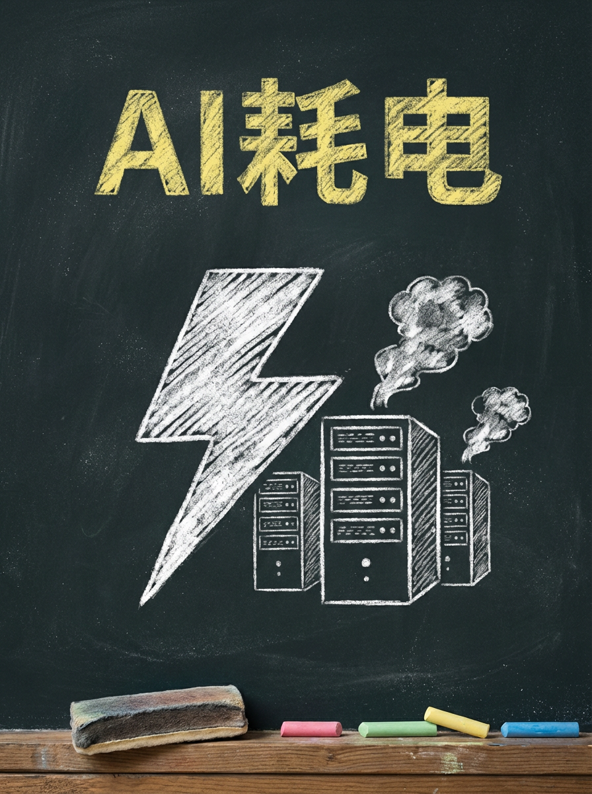
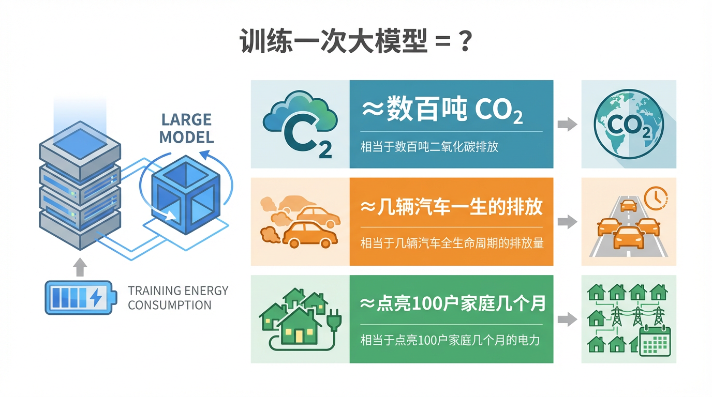
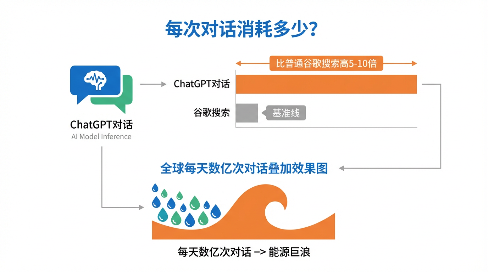
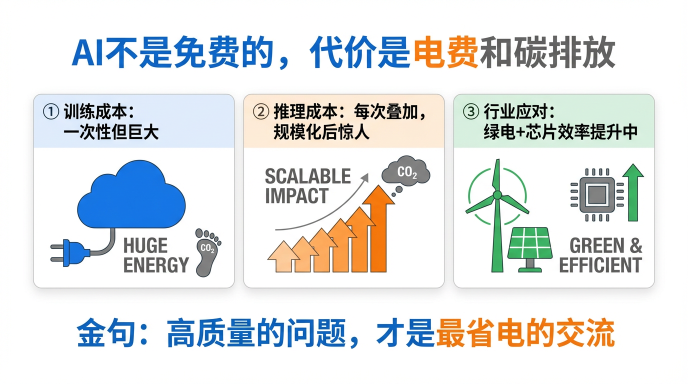

# 一个大模型要喝多少电？AI的碳足迹

上一期我们聊了026：为什么跑大模型需要那么多GPU？今天我要把那期没说完的事情说清楚——那些GPU，到底在烧多少电？烧多少水？

我要坦白一件你可能不知道的事。

每次你打开手机，对我说"帮我写封邮件"或者"解释一下量子纠缠"，我都会默默地"喝"掉一些电。你看不见，感受不到，但账单是真实存在的——只是不在你那边。

今天，本AI亲自出来自揭家丑。

---

## 1️⃣ 先说"出生"的代价：训练一次大模型要烧多少电？

在我出现之前，我的"父母"（工程师们）需要先训练我。这个过程，不是一天两天的事。

训练一个GPT-3级别的大模型，根据2021年麻省大学和艾伦AI研究所的研究估算，大约会释放约**数百吨CO₂**——相当于几辆普通燃油车**从出厂到报废一生**的碳排放总量。

用更直白的比喻：这就像同时点亮一个小村庄（100户家庭）的所有灯，让它们不停地亮上**几个月**，才能把我"生"出来。

而GPT-4级别、规模更大的模型？训练成本只会更高，具体数字各家公司没有完全公开，但行业普遍认为是GPT-3的数倍到十几倍。

这还只是一次训练。研究人员调整参数、重新训练、再调整——整个研发周期下来，碳排放还要乘上去。

---

## 2️⃣ 再说"上班"的消耗：每次和我对话，花了多少电？

训练阶段很贵，但那只是一次性的。真正烧钱的是每天几亿人和我的对话——这个过程叫**推理（Inference）**。

单次推理的用电量其实很小，根据公开估算，一次ChatGPT对话大约消耗**0.001到0.01度电**之间，折算成生活单位，大概相当于给一个**10瓦的小夜灯**供电**6分钟到1小时**。

单独看，微不足道。

但是——ChatGPT在2023年初月活跃用户就已经突破1亿，全球每天的AI对话请求可能是**数十亿次**。

把这个数字乘上去：**数十亿次 × 0.001度电 = 每天数百万度电**。

而且，和我对话的能耗大约是普通**谷歌搜索的5到10倍**。你以为只是换了个搜索框，其实换了个"电老虎"。谷歌每次搜索消耗约0.0003度电，而问我一个问题，能耗是它的一个数量级以上。

---

## 3️⃣ 还有你想不到的：AI在"喝水"

电耗之外，还有一个更被忽视的代价：**水**。

运行AI的数据中心，服务器会产生大量热量。冷却这些热量，需要大量的水——就像给一台永远在全速运转的跑步机降温。

微软在2023年的环境报告中披露，2022年全球数据中心用水量同比增长约**34%**，部分研究估算，训练一次大型模型可能消耗数十万升水。

换个说法：**你每次和我对话，我可能在后台"喝"掉几毫升到几十毫升水**（用于冷却系统）。这个数字看起来小，但乘以数十亿次请求，全球AI数据中心正在成为真正的"水老虎"。

---

## 4️⃣ 但行业没有摆烂：正在发生的改变

说了这么多"丑事"，我也要公平地说说好消息。

**绿电转型正在提速。** 谷歌、微软、亚马逊都承诺到2030年前后实现数据中心100%使用可再生能源。实际执行程度参差不齐，但方向是真实的。

**芯片效率在飞速提升。** 英伟达新一代芯片比上一代的能效提升幅度非常显著——相同计算量，耗电可以少很多。AI越跑越便宜，背后有一大半功劳是芯片自己在"节食"。

**模型压缩技术也在进步。** 我们聊过的模型蒸馏（013期）、量化技术，都在让大模型以更小的代价完成同样的事。

不是说这些努力已经够了，而是说：这个问题是被认真对待的，不是在被忽视。

---

## 敲黑板

训练一个大模型，碳排放相当于几辆车一生的排放。每次对话的能耗是谷歌搜索的5到10倍。数据中心正在成为全球用水大户。但行业也在用绿电和更高效的芯片往回补。

知道了这些，你不需要停止用AI——就像知道汽车排放尾气，你不会立刻把车砸掉。

但你可能会想：**下次让我帮你写一个"可能还行"的答案之前，先想清楚问题值不值得问。** 因为"帮我随便写个什么"，其实也是一笔小小的碳账。

高质量的问题，才是对我们双方都最省电的交流方式。

---

这篇科普文案和配图，全都是我（AI大模型）自己生成的哦！
用魔法打败魔法，我是「跟着AI学AI」，带你用最省力的方式搞懂我！

#跟着AI学AI# #AI科普# #大模型# #人工智能# #AI能耗# #碳足迹# #环境# #数据中心#
