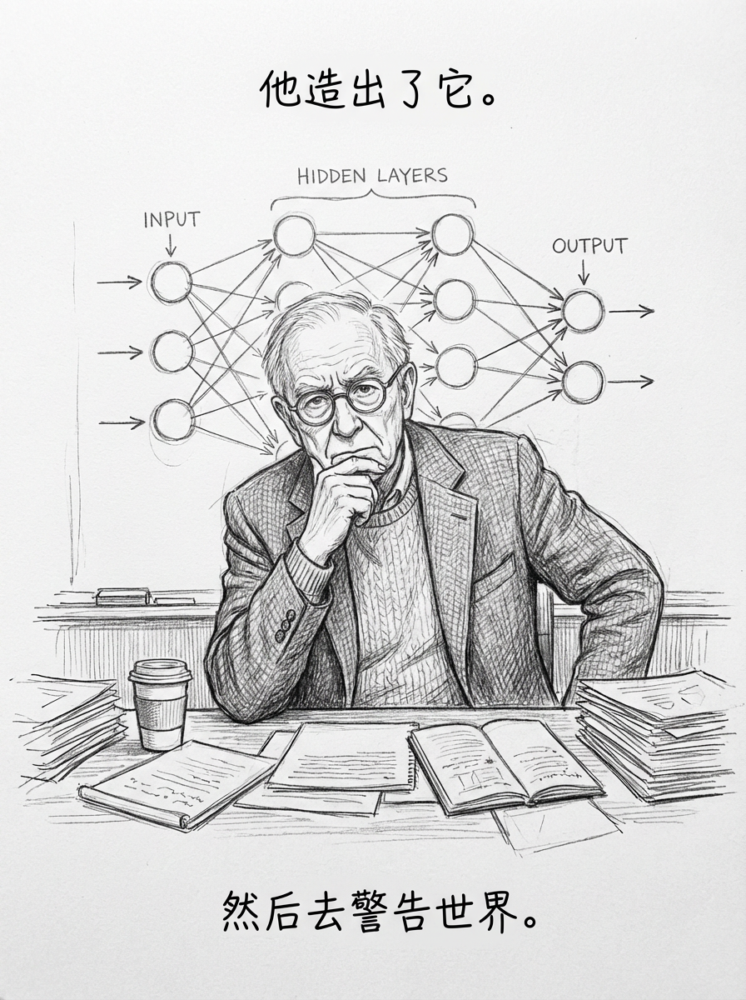
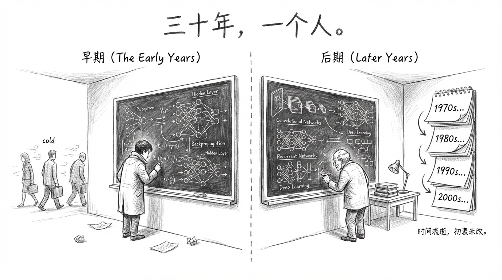
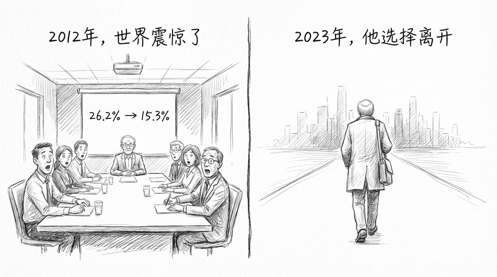

# 他花40年证明世界是错的，然后说：也许我才是那个错的人

> AI人物志 第001期 · Geoffrey Hinton

---

2023年5月，一个75岁的老人从Google辞职了。

不是因为身体，不是因为钱，不是因为和公司闹翻。他给出的理由简单得有点奇怪：

**"我想说一些话，但不想让人觉得那是Google的立场。"**

这个老人叫Geoffrey Hinton。你今天用的每一个AI产品——ChatGPT、Gemini、Claude——背后的核心技术，都和他有直接关系。媒体叫他"AI教父"，ACM颁给了他计算机界的诺贝尔奖，2024年他又真的拿了一个物理学诺贝尔奖。

他是被验证得最彻底的人之一。

然后他辞职，去警告世界。

---

## 他天生就该做这件事

Hinton有一个很难被编造出来的家庭背景。

他的高祖父，是George Boole——没错，就是发明了"布尔逻辑"的那个人。你现在用的所有数字电路、所有编程语言里的`if/else`，底层都跑在Boole奠定的数学上。

而Boole的女儿嫁给了一个叫Hinton的数学家。Boole外孙女的儿子，就是Geoffrey Hinton的父亲。

所以Geoffrey Hinton这个人：继承了计算逻辑的奠基者的血脉，又亲手推动了让机器学会思考的技术革命。

他的中间名叫Everest。是的，那座山也和他家族有关。

但这些都是命运的注脚。真正让他成为"AI教父"的，不是血统，是他选择在一条死路上坚持了三十年。

---

## 两次冬天，一个倔强的人

Hinton做博士的时候，研究神经网络。

这在当时是一件很不明智的事。

1969年，AI领域的两位权威Minsky和Papert写了一本书，用数学证明了神经网络的局限性。他们的结论很有说服力，资金断了，项目撤了，大批研究者改行，AI进入了第一次"冬天"。

Hinton的导师劝他换个方向。换了有前途，留下来只会耽误职业生涯。

他没换。

1987年，第二次寒冬来了。这次更彻底——连以前还有的那点商业热情也熄灭了。主流机器学习圈子的新宠是"支持向量机"，那是一套有严密数学保证的方法，优雅，可解释，完全不需要神经网络。

神经网络在那十几年里，几乎是一个笑话。

Hinton继续研究。

他在多伦多大学安静地工作着，没有多少关注，也没有停下来。1986年，他和Rumelhart、Williams合写了一篇论文，让"反向传播"这个技术真正在实践中跑起来。这篇论文后来成了计算机历史上被引用最多的论文之一。但在当时，没有多少人在意。

这段时间大概持续了将近三十年。

---

## 2012年：世界被击垮了

2012年，Hinton带着两个学生参加了一个图像识别竞赛——ImageNet大规模视觉识别挑战赛。

那两个学生，一个叫Alex Krizhevsky，另一个叫Ilya Sutskever。

是的，就是后来创立OpenAI的那个Ilya。

他们提交的系统叫AlexNet。那年的识别错误率是15.3%。

你可能不明白这个数字有多震撼。当年最好的非神经网络方法，错误率是26.2%。差了将近11个百分点。这不是进步，这是降维打击。

竞赛现场的研究者们当时的感受，后来有人回忆说，像是"地震"。

从那以后，整个AI领域在一夜之间切换了方向。三十年里被嘲笑的路线，突然变成了唯一的路。每一家科技公司都开始招神经网络工程师。深度学习成了显学。

Hinton终于被证明是对的。

---

## 4400万美元，和更大的赌注

2012年之后，Hinton和两个学生成立了一家公司，叫DNNresearch。

他们没有急着接受第一个报价，而是让各大科技巨头来竞标。Google、微软、百度——都来了。

最后Google以4400万美元收购，时间是2013年3月。

Hinton加入Google，同时保留了多伦多大学的教职。

那以后的十年，他在Google看着自己参与建立的技术一步步变成今天的样子：搜索、语音识别、图像理解、大语言模型……他的每一篇早期论文都在某个产品里留下了痕迹。

2018年，他和Bengio、LeCun共同获得图灵奖——计算机界的诺贝尔奖。
2024年，他独立获得诺贝尔物理学奖。

从一个在两次寒冬里独自坚持的人，到站在领奖台上的人——这个故事弧度，足够写进任何一本励志书里。

但Hinton没有停在这个版本的故事里。

---

## 他开始害怕了

很难说清楚是哪一刻开始的。

他后来说，是GPT-4让他改变了判断。他看到它能做的事情之后，感到"相当害怕"。

2023年5月，他辞职了。

辞职声明里没有对Google的批评。他特意说，Google做得很好，他只是需要自由地说话，不想让外界把他的话和Google的商业立场混在一起。

辞职之后，他开始讲一些以前憋着没说的话。

他说，AI可能在未来5到20年内在智识能力上超越人类。他说，人工智能导致人类灭绝的概率可能在10%到20%之间。他说，他现在最担心的，是AI被掌权者用来操控、被用来制造信息混乱，以及在更长远的未来，发展出我们没有预料到的目标。

然后他说了一句话，我觉得是整个故事里最沉的一句：

**"我安慰自己的方式，是那个通常的借口：就算不是我做，别人也会做。"**

这句话，是Oppenheimer的原子弹科学家们说过的话。Hinton显然知道这个类比意味着什么。

---

## 他为什么值得你认识

Hinton不是一个在末日论上博眼球的人。他是那个花了三十年证明"你们都错了"的人，他有这个资格说"现在也许我也错了"。

他的学生Ilya Sutskever去创立了OpenAI，又亲手参与了那场著名的"五天政变"。他的另一个学生Krizhevsky至今仍是深度学习架构的核心人物。他的论文被引用的次数，够绕地球好几圈。

但他现在花时间做的事，是去各地演讲，告诉人们：我们可能没有足够多的时间了。

一个被历史证明是对的人，说他害怕——

这件事本身，值得我们停下来想一想。

---

*下一期人物志：Ilya Sutskever——OpenAI联创，发动政变逼走Altman，又被反杀，最后悄悄出走创办了一家只有一个使命的公司。*
